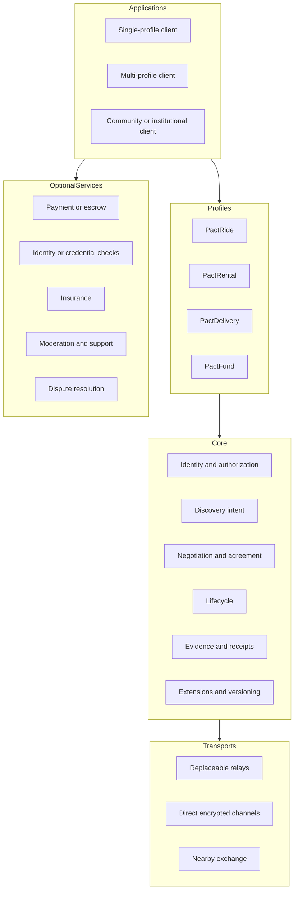

# Architecture

## Layers

## Core responsibilities

The core defines:

- common envelope and deterministic event identifiers;
- actor authorization and proofs;
- pact identifiers and causal references;
- expiring discovery intent;
- proposal, counterproposal, acceptance, and canonical terms;
- generic lifecycle vocabulary;
- claims, receipts, conflicts, and revocations;
- profile identifiers and extensions;
- compatibility and migration requirements.

## Profile responsibilities

Each profile defines:

- domain parties and roles;
- public discovery fields and prohibited public data;
- complete negotiable terms;
- required signers;
- activation and completion proofs;
- domain-specific lifecycle refinements;
- cancellation and abnormal termination;
- privacy, safety, accessibility, legal, and operational boundaries;
- semantic validation and test vectors.

## Application responsibilities

Applications decide:

- interface and accessibility;
- local matching and ranking;
- key storage and recovery;
- relay selection;
- local policy and moderation;
- which optional services to integrate;
- support and incident response;
- jurisdiction and operational availability;
- disclosure of fees and dependencies.

## Optional-service rule

An optional service may be essential for a specific deployment or jurisdiction. "Optional at the protocol level" does not mean "unnecessary in reality." Profiles and applications must state when a service becomes operationally or legally required.

## No universal backend

CommonPact may be carried over internet relays, direct channels, institutional servers, or nearby exchange. A deployment may run backend infrastructure. Compatibility must not depend on one canonical CommonPact backend.

## Cross-cutting specifications

- Human journeys: [`USE_CASES_AND_USER_JOURNEYS.md`](USE_CASES_AND_USER_JOURNEYS.md)
- Core/profile abstraction test: [`CORE_PROFILE_MAPPING.md`](CORE_PROFILE_MAPPING.md)
- Adoption and concentration: [`ADOPTION_AND_NETWORK_BOOTSTRAP.md`](ADOPTION_AND_NETWORK_BOOTSTRAP.md)
- Key recovery: [`KEY_MANAGEMENT_AND_RECOVERY.md`](KEY_MANAGEMENT_AND_RECOVERY.md)
- Portability: [`DATA_PORTABILITY.md`](DATA_PORTABILITY.md)
- Abuse and moderation: [`ABUSE_AND_MODERATION.md`](ABUSE_AND_MODERATION.md)

A formally optional provider can become a practical gatekeeper. Architecture review must therefore measure concentration in discovery, push delivery, identity, payments, reputation, app distribution, and certification.
