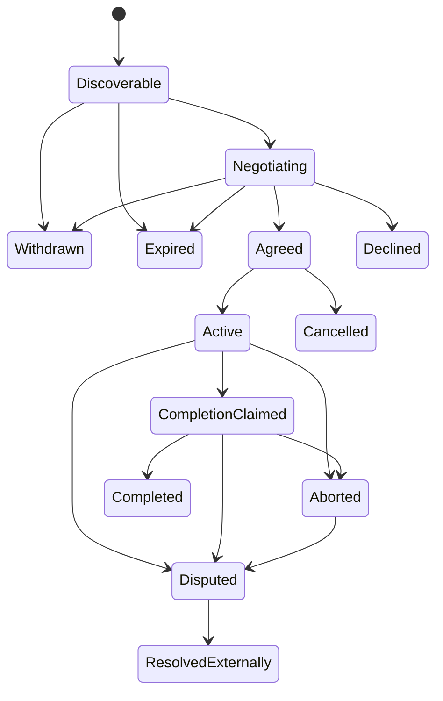

# Pact Lifecycle

## Generic states

- **Discoverable** — an expiring intent can be matched.
- **Negotiating** — proposal threads exist.
- **Agreed** — required parties authorized identical terms.
- **Active** — profile-defined activation occurred.
- **CompletionClaimed** — at least one party claims completion.
- **Completed** — profile-required completion proof exists.

Exceptional outcomes are Withdrawn, Declined, Expired, Cancelled, Aborted, Disputed, and ResolvedExternally.

## Aggregate versus thread

One intent may receive several independent proposals. Declining one proposal must not automatically withdraw the intent unless the profile explicitly defines that behavior.

## Activation

Activation is domain-specific: PactRide pickup verification, PactRental asset handoff, PactDelivery custody transfer, or a PactFund profile-defined campaign condition. The core supplies the concept; the profile defines evidence and consequences.

## Cancellation versus abort

Cancellation occurs before activation. Abort occurs after obligations have materially begun. Profiles define refund, safety, evidence, and dispute consequences.

## Completion

A profile defines who may claim completion, required evidence, required signers, what remains outside the receipt, and how later ratings, refunds, disputes, or resolutions reference it.

## Reordering and replay

Clients evaluate causal references and current state, not relay arrival order. Duplicates are idempotent. Stale events must not reopen terminal states without an explicit profile process.
