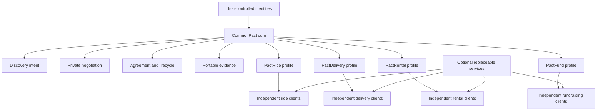
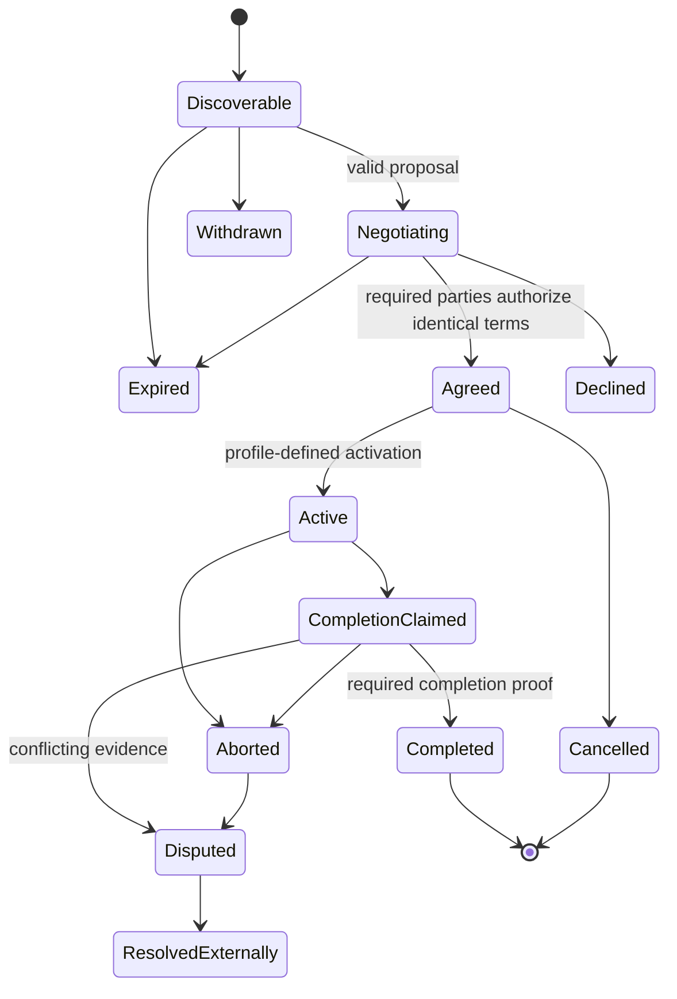

# CommonPact

> An open, profile-based protocol for direct coordination between people and organizations without requiring one platform to own discovery, agreement, evidence, or the relationship.

**Website:** https://wpgglabs.github.io/CommonPact/  
**Founder vision:** [`FOUNDER_VISION.md`](FOUNDER_VISION.md)  
**Canonical status:** [`STATUS.md`](STATUS.md)  
**Profile standard:** [`PROFILE_STANDARD.md`](PROFILE_STANDARD.md)  
**First profile:** [`PactRide`](https://github.com/wpggLabs/PactRide)
**Independent review:** [`REVIEW_REQUEST.md`](REVIEW_REQUEST.md) and [`REVIEW_LOG.md`](REVIEW_LOG.md)

## The problem

Modern platforms make coordination convenient, but often combine several separable functions—discovery, matching, identity, communication, payment, reputation, records, moderation, and support—under one company. The company then controls access to the network and may charge every transaction, change ranking or fees, deactivate participants, retain the customer relationship, and prevent users from moving their history to another application.

A rider commonly needs Uber or Lyft to find a driver. A sender needs a delivery marketplace to find a courier. An owner and renter depend on a rental platform. A donor and organizer may depend on a fundraising platform. In each case, useful infrastructure becomes a mandatory gatekeeper.

CommonPact asks:

**What if coordination worked more like email or the web—many compatible applications using shared rules—rather than one marketplace owning every interaction?**

## The proposal

CommonPact is a public protocol proposal for creating direct, inspectable agreements called **pacts**. It provides a reusable coordination core while leaving domain behavior to independently governed profiles such as:

- **PactRide** — ride requests and rider–driver coordination;
- **PactRental** — temporary transfer and return of an asset;
- **PactDelivery** — custody and delivery across one or more handoffs;
- **PactFund** — donation intent, campaign commitments, release evidence, and refunds;
- future profiles proposed through the public governance process.

A compatible client should eventually be able to:

1. create a user-controlled cryptographic identity;
2. publish a privacy-limited, expiring intent through replaceable transports;
3. discover compatible counterparties without a mandatory central dispatcher;
4. negotiate private terms;
5. authorize one canonical agreement;
6. record profile-defined activation, progress, cancellation, abnormal termination, completion, and dispute events;
7. distinguish one-sided claims from bilateral or multi-party evidence;
8. export portable receipts and attestations;
9. choose optional payment, escrow, identity, insurance, moderation, support, or dispute providers;
10. switch compatible applications without losing protocol access.

## What CommonPact is

- A domain-neutral coordination protocol proposal.
- A common event envelope, agreement model, lifecycle vocabulary, evidence model, profile system, and conformance framework.
- A way for independently developed applications to interoperate.
- A framework for replacing mandatory platform ownership with transparent, replaceable infrastructure.
- A public research project that exposes technical, economic, safety, privacy, governance, and adoption problems.

## What CommonPact is not

- Not one universal marketplace application.
- Not a promise that all intermediaries are unnecessary.
- Not a payment processor, bank, insurer, escrow agent, court, regulator, emergency service, identity authority, charity regulator, or logistics operator.
- Not a blockchain, token, DAO, cryptocurrency, or mandatory wallet.
- Not a guarantee of zero cost, zero fraud, physical safety, lawful operation, or market liquidity.
- Not a claim that PactRide, PactRental, PactDelivery, or PactFund are operating services.

## The key distinction

CommonPact does not attempt to remove every intermediary. Some services are useful or legally required. It attempts to remove the **mandatory platform owner**.

Optional providers may charge for maps, hosting, relays, identity checks, payments, escrow, insurance, moderation, customer support, audits, certification, or dispute handling. A profile or client must disclose those dependencies and fees. The base protocol does not require one provider or a commission payable to CommonPact.

## Design principles

1. **Protocol before platform** — shared semantics and conformance matter more than one official app.
2. **No mandatory platform owner** — compatible parties may coordinate through competing clients and infrastructure.
3. **No protocol tax** — the base protocol requires no commission, token, or fee payable to CommonPact.
4. **User-held identity** — users control keys and may move between compatible applications.
5. **Portable evidence** — receipts, attestations, warnings, and provenance are exportable.
6. **Replaceable infrastructure** — relays, transports, maps, payments, and other services are not canonical.
7. **Profile responsibility** — domain-specific safety, legal, accessibility, and operational rules stay in profiles.
8. **Data minimization** — public discovery carries only what is necessary for matching.
9. **Claim discipline** — signatures establish authorization, not physical truth, safety, payment finality, or legal compliance.
10. **Forkability and succession** — the specification must survive its original founder.

See [`PRINCIPLES.md`](PRINCIPLES.md) and [`NON_GOALS.md`](NON_GOALS.md).

## Generic pact lifecycle

Profiles may use stricter states and proof requirements. CommonPact does not silently reinterpret the existing PactRide wire format.

## Current status

**Founder-vision documentation: complete. Project maturity: pre-implementation research RFC with an initial machine-readable core.**

This repository documents the founder's current CommonPact vision, including user journeys, protocol boundaries, deterministic validation, strict event payloads, profile requirements, PactRide and PactRental mapping, cryptographic fixtures, adoption, economics, risks, governance, maintenance, implementation gates, and the GitHub Pages site.

This does not mean CommonPact is independently implemented, interoperable, production-safe, legally approved, funded, or adopted. PactRide is the first complete domain proposal. PactRental is included as a complete founder-authored Research RFC profile package and abstraction test. PactDelivery and PactFund remain candidate concepts requiring deeper domain work.

See [`STATUS.md`](STATUS.md) and [`FOUNDER_VISION.md`](FOUNDER_VISION.md).

## Repository map

### Vision and status
- [`FOUNDER_VISION.md`](FOUNDER_VISION.md)
- [`VISION.md`](VISION.md)
- [`PROBLEM_STATEMENT.md`](PROBLEM_STATEMENT.md)
- [`PRINCIPLES.md`](PRINCIPLES.md)
- [`NON_GOALS.md`](NON_GOALS.md)
- [`STATUS.md`](STATUS.md)
- [`GLOSSARY.md`](GLOSSARY.md)
- [`USE_CASES_AND_USER_JOURNEYS.md`](USE_CASES_AND_USER_JOURNEYS.md)
- [`ADOPTION_AND_NETWORK_BOOTSTRAP.md`](ADOPTION_AND_NETWORK_BOOTSTRAP.md)

### Core proposal
- [`ARCHITECTURE.md`](ARCHITECTURE.md)
- [`PROTOCOL.md`](PROTOCOL.md)
- [`PACT_LIFECYCLE.md`](PACT_LIFECYCLE.md)
- [`DISCOVERY_AND_MATCHING.md`](DISCOVERY_AND_MATCHING.md)
- [`NEGOTIATION_AND_AGREEMENT.md`](NEGOTIATION_AND_AGREEMENT.md)
- [`EVIDENCE_AND_RECEIPTS.md`](EVIDENCE_AND_RECEIPTS.md)
- [`IDENTITY.md`](IDENTITY.md)
- [`TRANSPORTS.md`](TRANSPORTS.md)
- [`INTEROPERABILITY.md`](INTEROPERABILITY.md)
- [`IMPLEMENTATION_GUIDE.md`](IMPLEMENTATION_GUIDE.md)
- [`TRANSPORT_PROFILE_STANDARD.md`](TRANSPORT_PROFILE_STANDARD.md)
- [`DATA_PORTABILITY.md`](DATA_PORTABILITY.md)
- [`KEY_MANAGEMENT_AND_RECOVERY.md`](KEY_MANAGEMENT_AND_RECOVERY.md)
- [`schemas/`](schemas/)
- [`test-vectors/`](test-vectors/)
- [`examples/`](examples/)

### Profiles
- [`PROFILE_STANDARD.md`](PROFILE_STANDARD.md)
- [`PROFILE_REGISTRY.md`](PROFILE_REGISTRY.md)
- [`profiles/`](profiles/)
- [`CORE_PROFILE_MAPPING.md`](CORE_PROFILE_MAPPING.md)
- [`profiles/pactride/MAPPING.md`](profiles/pactride/MAPPING.md)
- [`profiles/pactrental/README.md`](profiles/pactrental/README.md)
- [`profiles/pactdelivery/CONCEPT.md`](profiles/pactdelivery/CONCEPT.md)
- [`profiles/pactfund/CONCEPT.md`](profiles/pactfund/CONCEPT.md)

### Trust, economics, and boundaries
- [`RESPONSIBILITY_BOUNDARIES.md`](RESPONSIBILITY_BOUNDARIES.md)
- [`ACCESSIBILITY.md`](ACCESSIBILITY.md)
- [`ABUSE_AND_MODERATION.md`](ABUSE_AND_MODERATION.md)
- [`LEGAL_REVIEW_CHECKLIST.md`](LEGAL_REVIEW_CHECKLIST.md)
- [`PAYMENTS_AND_SETTLEMENT.md`](PAYMENTS_AND_SETTLEMENT.md)
- [`ECONOMICS.md`](ECONOMICS.md)
- [`TRUST_AND_REPUTATION.md`](TRUST_AND_REPUTATION.md)
- [`PRIVACY.md`](PRIVACY.md)
- [`THREAT_MODEL.md`](THREAT_MODEL.md)
- [`SECURITY.md`](SECURITY.md)
- [`FAILURE_MODES.md`](FAILURE_MODES.md)
- [`PRIOR_ART.md`](PRIOR_ART.md)

### Stewardship
- [`ROADMAP.md`](ROADMAP.md)
- [`GOVERNANCE.md`](GOVERNANCE.md)
- [`MAINTAINERS.md`](MAINTAINERS.md)
- [`MAINTENANCE.md`](MAINTENANCE.md)
- [`CONTRIBUTING.md`](CONTRIBUTING.md)
- [`CONTRIBUTOR_POLICY.md`](CONTRIBUTOR_POLICY.md)
- [`LICENSING.md`](LICENSING.md)
- [`MONETIZATION.md`](MONETIZATION.md)
- [`TRADEMARK.md`](TRADEMARK.md)
- [`FAQ.md`](FAQ.md)
- [`BRAND_SYSTEM.md`](BRAND_SYSTEM.md)

## How to participate

Useful contributions include:

- identifying a concrete protocol or profile failure;
- comparing CommonPact against prior standards using primary sources;
- implementing an independent parser or validator;
- supplying valid and invalid conformance fixtures;
- challenging whether a proposed core concept is genuinely domain-neutral;
- documenting a real workflow that a profile cannot represent;
- contributing privacy, security, accessibility, legal, economic, or operational analysis.

General support is welcome, but the most useful contribution is a falsifiable criticism, reproducible test, independent implementation, or carefully bounded profile proposal.

## License

The current specification repository is licensed under the **Apache License 2.0**. It permits commercial and noncommercial use, modification, distribution, and independent implementations subject to the license conditions. It does not require royalties, revenue sharing, publication of modifications, or payment to CommonPact.

The CommonPact name, logo, endorsement, and any future compatibility marks are governed separately. See [`LICENSING.md`](LICENSING.md) and [`TRADEMARK.md`](TRADEMARK.md).
