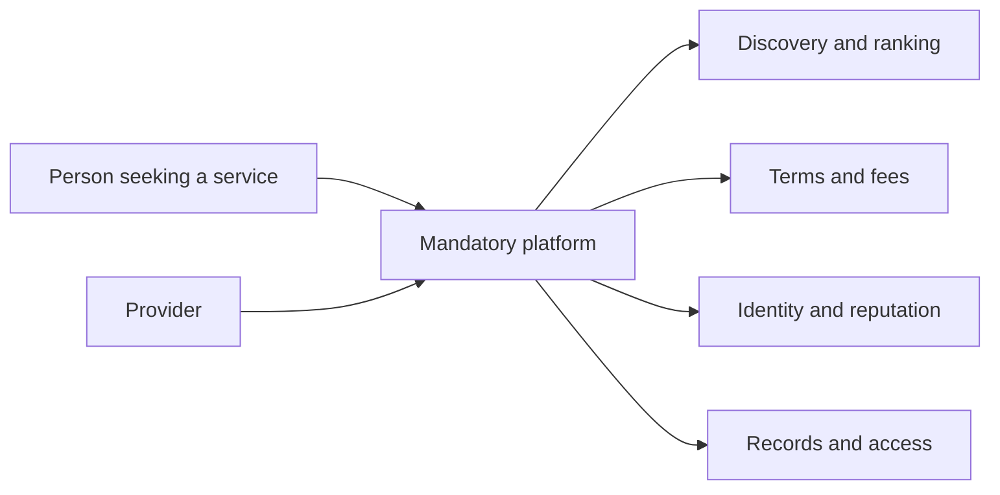
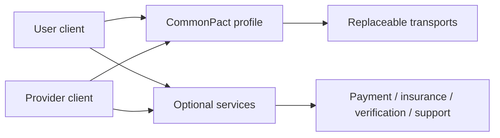

# Use Cases and User Journeys

This document translates the protocol architecture into concrete human journeys. It does not claim any journey is operational today.

## Closed-platform pattern

The platform may provide real value, but both sides must accept its rules, fees, account control, and data custody to reach each other.

## CommonPact pattern

Shared protocol rules carry discovery, negotiation, agreement, lifecycle, and evidence. Applications and optional providers compete above that layer.

## Journey 1: PactRide

1. A rider publishes a coarse, expiring ride intent.
2. Driver clients discover the request through one or more replaceable relays.
3. Exact pickup, destination, price, and accommodations are negotiated privately.
4. Rider and driver authorize identical terms.
5. Pickup verification activates the ride.
6. Progress and abnormal termination follow PactRide-specific rules.
7. A unilateral completion remains a claim; matching proof creates a portable receipt.
8. Payment, insurance, mapping, emergency support, and legal operation remain external responsibilities.

What changes: Uber or Lyft is no longer required to own the protocol relationship.  
What remains: real transportation operations, safety, law, support, insurance, and market density.

## Journey 2: PactRental

1. An owner advertises a broad asset category and availability without publishing storage details.
2. A renter requests exact terms privately.
3. Both parties agree on duration, price, deposit method, permitted use, handoff, return, and evidence rules.
4. Bilateral handoff proof records condition evidence hashes and possession transfer.
5. The renter uses the asset under profile-defined obligations.
6. Return evidence produces either a bilateral receipt or a dispute with preserved competing evidence.
7. Escrow, insurance, inspections, liability, and court remedies remain optional or legally required external services.

What this tests: persistent assets, possession, delayed damage, and deposits differ materially from rides.

## Journey 3: PactDelivery concept

A sender, courier, and recipient may need multiple custody handoffs, address privacy, failed-delivery handling, return-to-sender, subcontracting, and prohibited-goods controls. The concept remains non-operational until those signer and responsibility rules are fully reviewed.

## Journey 4: PactFund concept

A donor and organizer may express purpose, conditions, evidence, releases, and refunds, but CommonPact must not hold money or imply legal charitable status. Payment processors, custodians, tax records, sanctions checks, fraud controls, and regulators may be mandatory in practice. PactFund remains a high-risk concept pending professional review.

## What CommonPact can remove

- mandatory ownership of the coordination language;
- forced protocol-level commission;
- inability to switch compatible applications;
- platform-exclusive identity and history;
- one canonical relay, processor, or interface.

## What CommonPact cannot remove

- infrastructure cost;
- fraud, spam, coercion, or physical risk;
- legal obligations and regulated services;
- the need for accountable operators in real deployments;
- market bootstrapping and support;
- human judgment in disputes.
