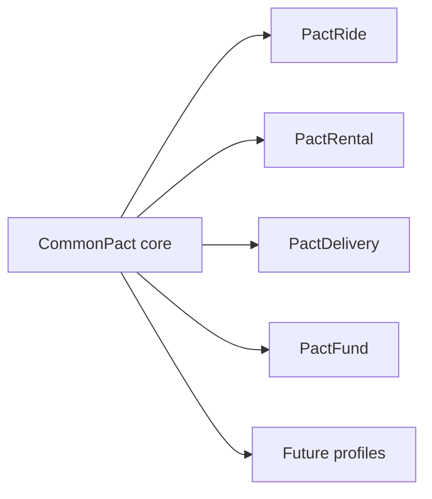

# Vision

## A common layer for voluntary coordination

People should be able to coordinate through software without surrendering the underlying relationship to one platform.

CommonPact defines a shared layer below marketplaces and service applications. That layer expresses discovery intent, negotiation, agreement, lifecycle events, evidence, and portable records. Applications compete above it. Communities may operate infrastructure around it. Profiles impose domain-specific requirements. The common layer remains open and replaceable.

## Desired properties

A mature ecosystem would allow users to choose compatible clients, providers to serve users from several clients, communities to run their own relays and policies, identity and evidence to remain user-controlled, fees and rankings to be visible, optional services to compete, and the protocol to survive any single company or founder.

## Success

Success requires independent implementations, multiple profile maintainers, portable pacts accepted across applications, transparent replaceable providers, and bounded pilots with accountable operators.

## Failure

CommonPact fails if it becomes an abstract framework that fits nothing, one centralized super-app, a token project looking for a use case, a way to evade responsibility, a branding umbrella without interoperability, or a protocol whose optional services are practically controlled by one party.
