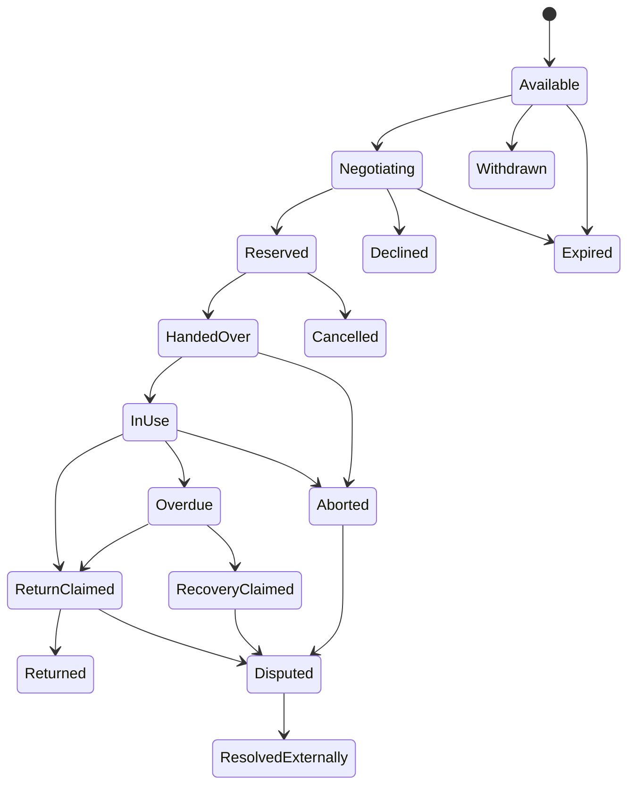

# PactRental Lifecycle and Signer Matrix

| Transition | Event | Required author or signer set |
|---|---|---|
| create availability | `intent.publish` | owner or authorized delegate |
| withdraw | `intent.withdraw` | publisher |
| propose/counter | `pact.proposal` / `pact.counter` | proposing party |
| reserve | matching `pact.accept` events | owner and renter separately authorize same terms |
| handoff | `pact.activate` | owner + renter; custodian if terms require |
| progress | `pact.update` | role permitted by update subtype |
| cancel before handoff | `pact.cancel` | signer rule in accepted terms; unilateral cancellation remains attributable |
| early end after handoff | `pact.abort` | terminating party; mutual abort may include both |
| claim return | `pact.completion.claim` | claimant |
| confirm return | `pact.completion.receipt` | exact owner + renter set; custodian if required |
| dispute | `pact.dispute` | disputing party |
| external resolution | `pact.resolution.reference` | party or named resolver according to terms |

Arrival order never resolves competing state. A valid receipt and a later external damage claim can coexist; clients must present provenance and profile policy.
